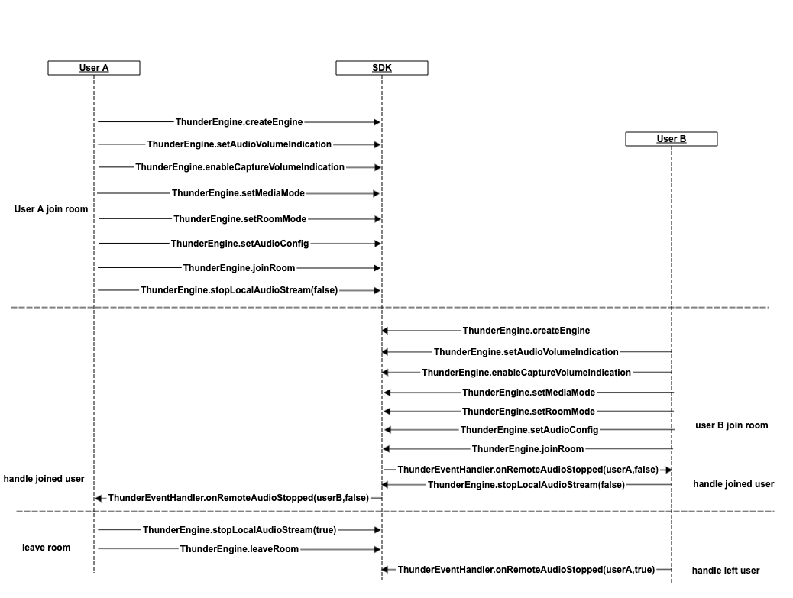

## Audio Publishing
[中文](README.zh.md) | [English](README.md)

This demo describes how to quickly integrate Jocloud SDK to implement audio publishing into your applications.
With this demo you can perform the following functions:
Join/exit a room
Set audio parameters
Switch speaker
Turn on/off microphone
Enable/disable in-ear monitoring
Change voice


### API Calling Flow


### API Details

(1)Initialize the ThunderSDK
```
    thunderEngine = ThunderEngine.createEngine(context, appId, sceneId, handler);
```
(2)Enable speaker volume prompt, turn on collection volume callback
```
    //Enable speaker volume prompt
    thunderEngine.setAudioVolumeIndication(interval, moreThanThd, lessThanThd, smooth);
    //turn on collection volume callback
    thunderEngine.enableCaptureVolumeIndication(interval, moreThanThd, lessThanThd, smooth);
   
```
(3)Set media mode, room mode, and audio parameters
```
    //Set media mode
    thunderEngine.setMediaMode(mode);
    //set room scene mode
    thunderEngine.setRoomMode(mode)
    //set audio configuration
    thunderEngine.setAudioConfig(profile, commutMode, scenarioMode)

```
(4)Join a room
```
    thunderEngine.joinRoom(token, roomId, uid);
    thunderEngine.stopLocalAudioStream(false);
```

(5)Exit a room
```
   thunderEngine.stopLocalAudioStream(true);
   thunderEngine.leaveRoom();
```
(6)Set audio parameters
```
   thunderEngine.setAudioConfig(profile, commutMode, scenarioMode);
```
(7)Speaker and earphone switching
```
   thunderEngine.enableLoudspeaker(enabled);
```
(8)Turn on/off audio collect and streaming
```
   thunderEngine.stopLocalAudioStream(stop);
```
(9)Turn on/off in-ear monitoring
```
   thunderEngine.setEnableInEarMonitor(enabled);
```
(10)Change voice
```
    thunderEngine.setVoiceChanger(mode);
```