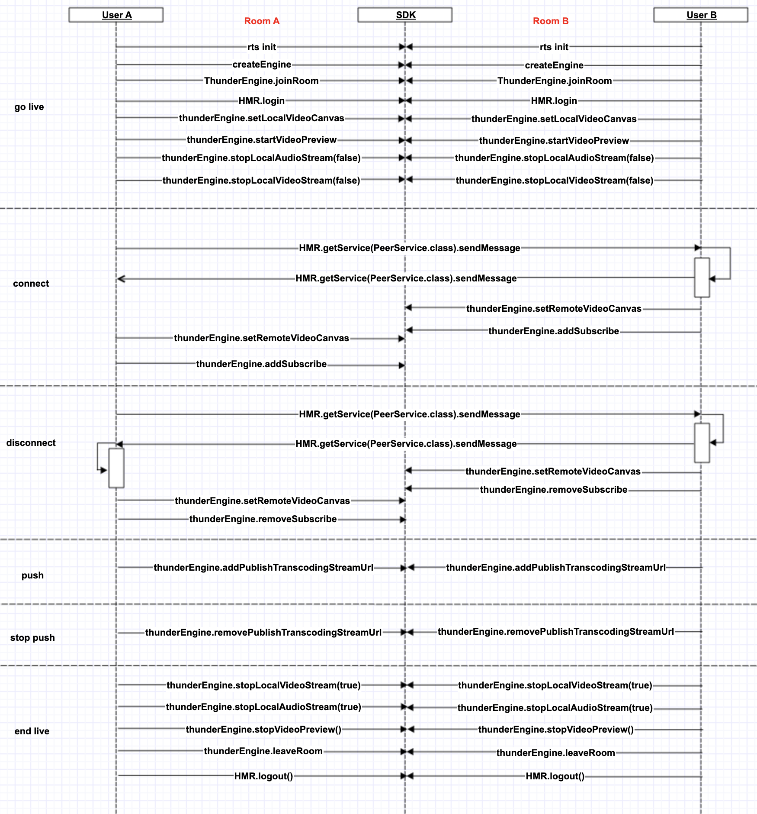

# 使用 Thunderbolt 和 Hummer SDK 实现主播PK连麦

* [简体中文](README.zh.md) | [English](README.md)*

## 1.概览
该Demo演示了如何结合使用Thunderbolt SDK和RTS SDK实现主播PK连麦。Thunderbolt SDK实现媒体功能，包括开播，推流和订阅；RTS SDK实现两个用户的信令交互，包括邀请连麦、同意连麦、拒绝连麦、取消连麦。


## 2.API调用流程

### 2.1 开播

```objc
    //Thunderbolt
    //joinRoom
    [self.thunderEngine joinRoom:token roomName:roomName uid:uid];
    
    //push
    [self setVideoEncoderConfig:liveMode];
    // 设置本地视图
    [self setLocalCanvas:mPreviewContainer uid:uid];
    // 开启预览
    [self.thunderEngine startVideoPreview];
    // 开播 音频
    [self.thunderEngine stopLocalAudioStream:NO];
    // 开播 视频
    [self.thunderEngine stopLocalVideoStream:NO];

    //Hummer登录
    [Hummer loginWithUid:uid region:region token:token completion:completion];

```

### 2.2 下播

```objc
    //Thunderbolt
    [self.thunderEngine leaveRoom];

    //Hummer退出登录
    [Hummer logout];
```

### 2.3 邀请连麦

> **注意：**
>
> - 连麦前必须先开播。
> - 远端roomID和本地roomID不能相同。
> - 由于 Hummer 的端对端信令消息，在用户登录SDK后即可使用，不需要用户进入房间，所以存在一个异常情况，即用户给不同房间，与自己相同UID发送端到端的信令消息时，自己也能收到消息的通知回调。这时需要业务做处理，当收到的消息里房间号和UID信息自己的一样时，不做连麦处理。

```objc
    // 发送连麦邀请消息
    [[HMRPeerService instance] sendMessage:message withOptions:nil toUser:user completion:^(HMRRequestId reqId, NSError *error) {
        
    }];

    //监听收到的消息回调
    [[HMRPeerService instance] addObserver:observer];
```

### 2.4 连麦

```objc
    //订阅远端用户音视频流
    [self.thunderEngine addSubscribe:roomId uid:uid];
    //展示远端画布
    ThunderVideoCanvas *canvas = [[ThunderVideoCanvas alloc] init];
    canvas.view = mPlayerViewContainer;
    [canvas setRenderMode:THUNDER_RENDER_MODE_CLIP_TO_BOUNDS];
    [canvas setUid:remoteUid];
    [self.thunderEngine setRemoteVideoCanvas:canvas];
    [self.thunderEngine setRemoteCanvasScaleMode:remoteUid mode:THUNDER_RENDER_MODE_CLIP_TO_BOUNDS];
```

### 2.5 取消连麦

```objc
    //取消订阅
    [self.thunderEngine removeSubscribe:roomId uid:uid];
```

### 2.6 推流

> **注意：**
>
> - 推流前必须先开播。
> - 该接口需在进房间后调用，退出房间会清空该配置。
> - 调用该接口后，会将主播当前音视频流推送到指定的CDN地址。若要更新URL需要先调用 removePublishOriginStreamUrl 删除原地址后再添加。
> - 该方法每次只能增加一路推流地址。若需推送多路流，则需多次调用该方法。最多支持添加5个推流地址。
> - 开播后服务器会将源流推到对应的URL上。

```objc
    //添加转码任务
    [self.thunderEngine setLiveTranscodingTask:taskId transcoding:transcoding];
    //添加转码流的推流地址
    [self.thunderEngine addPublishTranscodingStreamUrl:taskId url:url];
```

### 2.7 停止推流

```objc
    //删除转码流的推流地址
    [self.thunderEngine removePublishTranscodingStreamUrl:taskId url:url];
    //删除转码任务
    [self.thunderEngine removeLiveTranscodingTask:taskId];
```

### 2.8 切换摄像头

```objc
    //切到前/后置摄像头
    [self.thunderEngine switchFrontCamera:bFront];
```

### 2.9 开关摄像头

```objc
    //停止推视频流
    [self.thunderEngine stopLocalVideoStream:stopped];
```

### 2.10 开关麦克风

```objc
    //停止推音频流
    [self.thunderEngine stopLocalAudioStream:stopped];
```

### 2.11 说明
> - thunderbolt SDK 不支持多设备同时登录，业务需要做处理多设备同时登录的问题。

## 3 异常处理
|异常|解决方法|
|:-----|:-----|
|连麦过程中，对方断网|本地判定回调onRemoteVideoStopped 和 onRemoteAudioStopped，音视频下行都没有，认为对方已经离开，主动取消订阅对方，同时发送一条消息告诉对方取消订阅对方；对方恢复网络后，会收到该消息并且取消订阅对方的音视频流|
|连麦过程中，对方杀进程|本地判定回调onRemoteVideoStopped 和 onRemoteAudioStopped，音视频下行都没有，就认为对方已经离开，主动取消订阅对方，同时发送一条消息告诉对方取消订阅对方|

