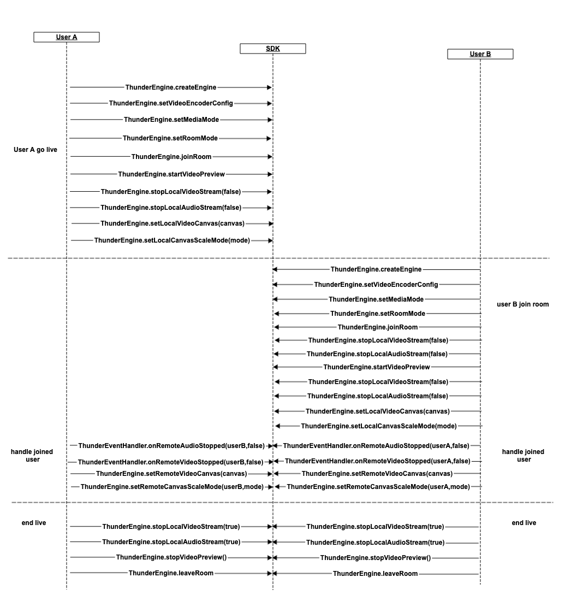

## 同房间多人连麦
*[简体中文](README.zh.md) | [English](README.md)*

该Demo演示了如何快速集成聚联云SDK，实现同房间多人连麦。包含了以下功能：
- 加入/离开房间
- 开/关麦
- 开/关摄像头
- 切换前置/后置摄像头
- 记录日志信息
- 放大/还原视图

> 集成SDK到APP，请参考：[SDK集成方法](https://docs.aivacom.com/cloud/cn/product_category/rtc_service/rt_video_interaction/integration_and_start/integration_and_start_ios.html)

> API开发手册，请访问： [Android API](https://docs.aivacom.com/cloud/cn/product_category/rtc_service/rt_video_interaction/api/iOS/v2.8.0/category.html)

### API调用流程图


### API说明
 （1）初始化ThunderSDK
 ```objc
     self.thunderEngine = [ThunderEngine createEngine:appId sceneId:sceneId delegate:delegate];
```
 
（2）设置开播视频的编码配置，设置媒体模式，设置房间场景模式
```objc
    [self.thunderEngine setMediaMode:mediaMode];
    [self.thunderEngine setRoomMode:roomMode];
    ThunderVideoEncoderConfiguration *videoEncoderConfiguration = [[ThunderVideoEncoderConfiguration alloc] init];
    /// 设置开播玩法为视频连麦开播
    videoEncoderConfiguration.playType = THUNDERPUBLISH_PLAY_INTERACT;
    // 设置视频编码类型
    videoEncoderConfiguration.publishMode = pubishMode;
    // 每次进房间都需要再次设置，否则会使用默认配置
    [self.thunderEngine setVideoEncoderConfig:videoEncoderConfiguration];
```

（3）加入房间
            从业务服务器获取[token接入方法](https://docs.aivacom.com/cloud/cn/platform/restful_api/http_auth/http_auth.html)
```objc
    [self.thunderEngine joinRoom:token roomName:roomName uid:uid];
```

（4）离开房间
```objc
    [self.thunderEngine leaveRoom];
```

（5）加入/离开房间回调
```objc
    - (void)thunderEngine:(ThunderEngine *)engine onJoinRoomSuccess:(NSString *)room withUid:(NSString *)uid elapsed:(NSInteger)elapsed
    {
    
    }
    
    - (void)thunderEngine:(ThunderEngine *)engine onLeaveRoomWithStats:(ThunderRtcRoomStats *)stats
    {
    
    }
```

（6）开播
```objc
    [self setVideoEncoderConfig:liveMode];
    // 设置本地视图
    ThunderVideoCanvas *canvas = [[ThunderVideoCanvas alloc] init];
    canvas.view = preview;
    [canvas setRenderMode:THUNDER_RENDER_MODE_CLIP_TO_BOUNDS];
    [canvas setUid:uid];
    [self.thunderEngine setLocalVideoCanvas:canvas];
    [self.thunderEngine setLocalCanvasScaleMode:THUNDER_RENDER_MODE_CLIP_TO_BOUNDS];
    // 开启预览
    [self.thunderEngine startVideoPreview];
    // 开播 音频
    [self.thunderEngine stopLocalAudioStream:NO];
    // 开播 视频
    [self.thunderEngine stopLocalVideoStream:NO];
```

（7）停播
```objc
    [self.thunderEngine stopLocalAudioStream:YES];
    [self.thunderEngine stopLocalVideoStream:YES];
```

（8）远端音/视频流回调通知<br />
    &emsp;&emsp;&emsp;当远端用户推送音频流或视频流则表示用户加入房间，如果远端用户停止推送音/视频流则表示远端用户退出房间
```objc
    - (void)thunderEngine:(ThunderEngine *)engine onRemoteAudioStopped:(BOOL)stopped byUid:(NSString *)uid
    {
        [self handleOnRemoteStreamStopped:stopped uid:uid type:RemoteStreamTypeAudio];
    }

    - (void)thunderEngine:(ThunderEngine *)engine onRemoteVideoStopped:(BOOL)stopped byUid:(NSString *)uid
    {
        [self handleOnRemoteStreamStopped:stopped uid:uid type:RemoteStreamTypeVideo];
    }  
```

（9）打开/关闭推送视频流
```objc
    [self.thunderEngine stopLocalVideoStream:stopped];
```

（10）打开/关闭推送音频流
```objc
     [self.thunderEngine stopLocalAudioStream:stopped];
```
（11）切换前后置摄像头
```objc
     [self.thunderEngine switchFrontCamera:bFront];
```

（12）接收/关闭远端音/视频流
```objc
    //接收/关闭远端音频流
    [self.thunderEngine stopRemoteAudioStream:uid stopped:stopped];

    //接收/关闭远端视频流
    [self.thunderEngine stopRemoteVideoStream:uid stopped:stopped];
```
